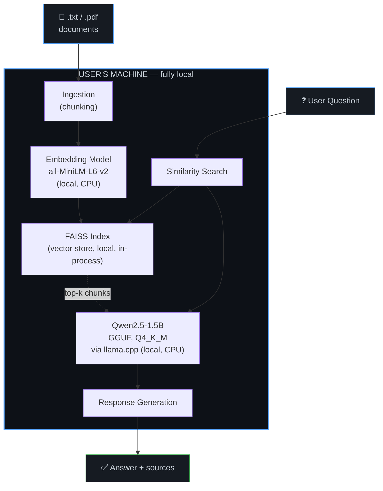

# Architecture

## System Overview

Vault-Mind is a Retrieval-Augmented Generation (RAG) system where every AI component runs locally on the user's machine. There is no server-side or cloud AI component in the core loop.

## Data Flow Diagram

**Interfaces:** CLI (`app.py`) or Local Web UI (`web_app.py`, Gradio) — both are local-only interfaces to the same underlying pipeline shown above.

## Model Pipeline

1. **Ingestion** (`src/ingest.py`) — documents are read (`pypdf` for PDF, plain read for `.txt`), split into word-based chunks (~300 words, 30-word overlap).
2. **Embedding** (`src/embed.py`) — each chunk is converted to a 384-dimension vector using `all-MiniLM-L6-v2`.
3. **Indexing** (`src/vector_store.py`) — vectors are stored in a local FAISS flat index (`IndexFlatL2`), along with the source chunk text and originating filename.
4. **Retrieval** (`src/rag.py`) — at query time, the question is embedded the same way, and the top-3 nearest chunks (by L2 distance) are retrieved.
5. **Generation** (`src/llm.py`) — retrieved chunks + the question are assembled into a prompt and passed to Qwen2.5-1.5B-Instruct (Q4_K_M GGUF) running through `llama.cpp`, with a system prompt instructing the model to answer only from the given context and to admit when it doesn't know.

## Local vs. Cloud Components

| Component | Location | Notes |
|---|---|---|
| Document parsing | Local | `pypdf`, plain file read |
| Embedding generation | Local | `all-MiniLM-L6-v2`, CPU |
| Vector search | Local | FAISS, in-process, no external DB |
| LLM inference | Local | `llama.cpp`, CPU, quantized model |
| Model weights download | One-time, network | Downloaded once via Hugging Face Hub, same as installing any local software; not used at inference time |
| Web UI | Local | Gradio, bound to `127.0.0.1` only — not a hosted service |

**No component in the actual question-answering loop makes a network call.**

## Key Design Decisions

- **FAISS flat index over an approximate index (e.g. HNSW):** at hackathon scale (tens to low hundreds of chunks), exact search is fast enough (~20-50ms) and avoids the complexity/tuning of approximate methods.
- **Word-based chunking over sentence/semantic chunking:** simpler and faster to implement under time constraints; empirically produced correct answers on real test documents (see `EVALUATION.md`). Semantic chunking is noted as future work.
- **Q4_K_M quantization over other GGUF quant levels:** chosen for its established balance of size vs. answer quality in the llama.cpp community, prioritizing correctness for reasoning-heavy queries over marginal speed gains from more aggressive quantization (e.g. Q4_0).
- **CLI + separate Web UI sharing the same pipeline code:** both `app.py` and `web_app.py` import from the same `src/` modules, so there is one source of truth for the RAG logic — no duplicated logic between interfaces.
- **Gradio bound to localhost only:** deliberately not using `share=True`, since that would tunnel traffic through Gradio's servers, contradicting the "no data leaves your device" guarantee.
