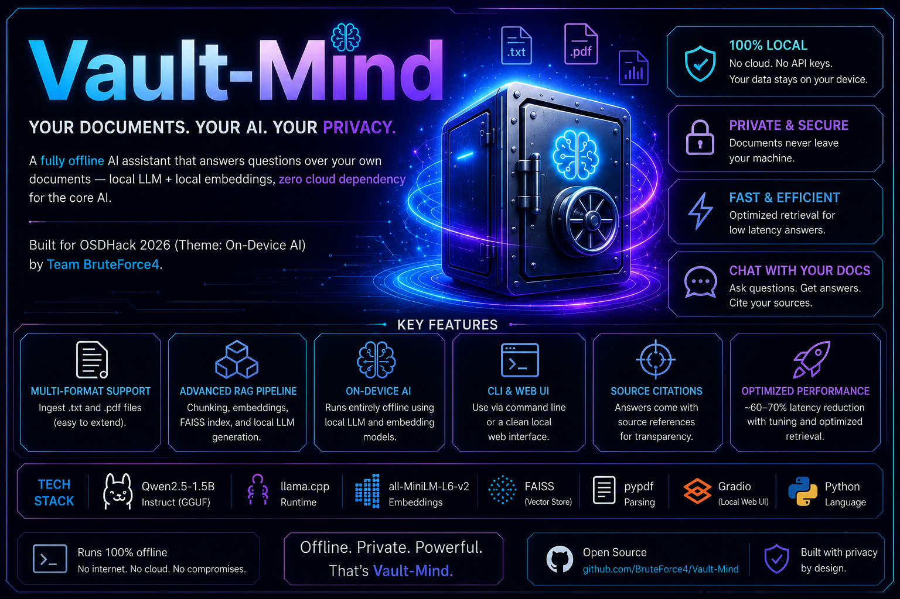
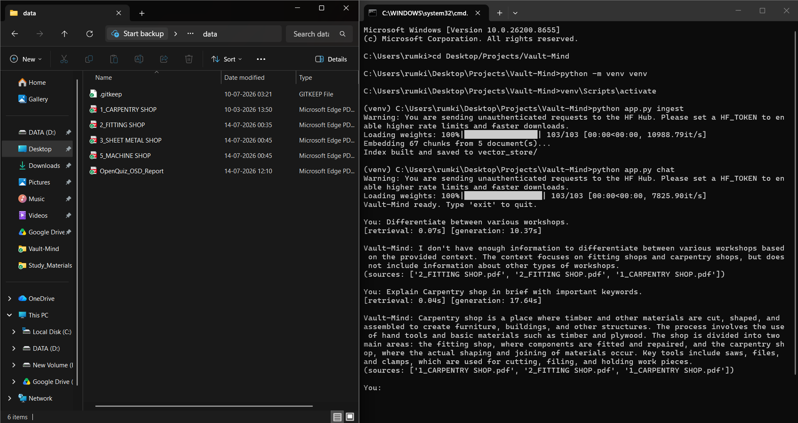
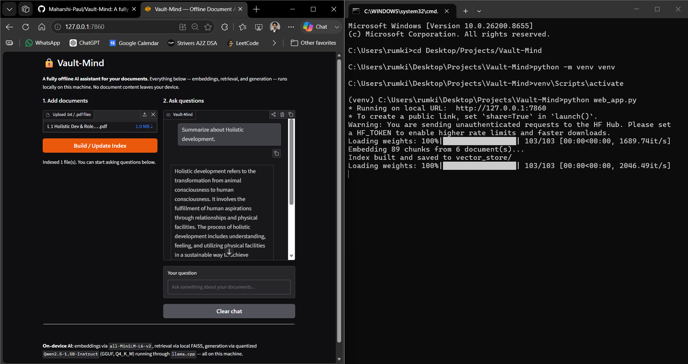
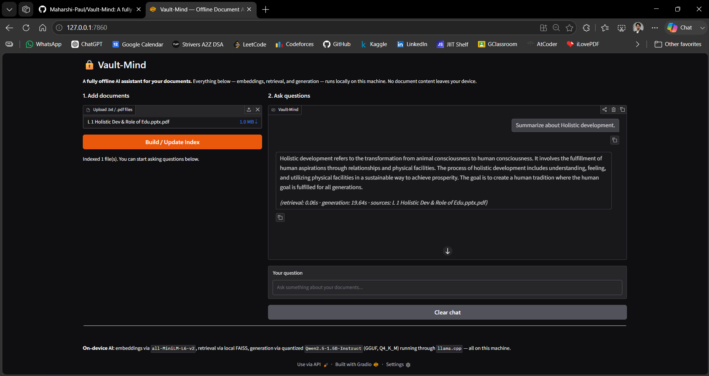

<p align="center">
  
</p>

# Vault-Mind

**A fully offline AI assistant that answers questions over your own documents — local LLM + local embeddings, zero cloud dependency for the core AI.**

Built for **OSDHack 2026** (Theme: On-Device AI) by [Maharshi-Paul](https://github.com/Maharshi-Paul) & Team **BruteForce4**.

---

## Table of Contents

- [Problem](#problem)
- [Solution](#solution)
- [On-Device AI Usage](#on-device-ai-usage)
- [Tech Stack](#tech-stack)
- [Project Structure](#project-structure)
- [Setup](#setup)
- [Usage](#usage)
- [Example Q&A](#example-qa)
- [Performance & Optimization](#performance--optimization)
- [Demo](#demo)
- [Screenshots](#screenshots)
- [Known Limitations / Future Scope](#known-limitations--future-scope)
- [License](#license)

---

## Problem

AI tools that let you "chat with your documents" — ChatGPT file upload, cloud RAG SaaS products, etc. — require sending your files to a remote server for processing. This is a dealbreaker for private notes, confidential work, academic material, or any offline/air-gapped environment. Your data is only as safe as someone else's infrastructure, and it simply doesn't work without an internet connection.

## Solution

Vault-Mind is a **Retrieval-Augmented Generation (RAG)** assistant that runs its **entire AI pipeline locally**:

1. Your documents (`.txt`, `.pdf`) — one or many at once — are chunked and converted into vector embeddings on your machine.
2. Your question is embedded the same way, and the most relevant chunks are retrieved via local vector similarity search across **all** indexed documents.
3. A **quantized, locally-running LLM** reads those chunks and your question, and generates a grounded answer — citing which document(s) it came from.

No API keys. No internet dependency for the core loop. No document content ever leaves your device. Available both as a **CLI** and a **local browser-based web UI**.

Vault-Mind was stress-tested on real-world documents (multi-page workshop manuals with mixed prose, procedures, and diagrams — carpentry and fitting shop guides) and correctly:
- Answered direct factual questions
- Answered **indirectly-phrased** questions requiring inference (e.g. "which wood resists bending?" → correctly identified hard wood without the question using that term)
- Answered **multi-hop** questions requiring reasoning across different sections of a document
- **Refused to hallucinate** when asked about things not in the documents (e.g. tool pricing, safety certifications) instead of making something up
- Correctly cited **sources** when multiple documents were indexed at once

## On-Device AI Usage

**Runs 100% locally (core AI functionality):**

| Component | What it does | Runs on |
|---|---|---|
| `all-MiniLM-L6-v2` (via `sentence-transformers`) | Converts document chunks and user queries into vector embeddings | Local CPU |
| FAISS (flat index) | Performs vector similarity search to retrieve relevant chunks | Local, in-process, no external DB/server |
| `Qwen2.5-1.5B-Instruct` (GGUF, Q4_K_M quantized) via `llama.cpp` | Generates the final answer from retrieved context | Local CPU, no cloud inference API |

**Cloud/network usage:** None in the core loop. Model weights and Python packages are downloaded once ahead of time (equivalent to installing any local software) — after that, ingestion and chat both run fully offline, whether via CLI or the local web UI.

## Tech Stack

| Layer | Tool |
|---|---|
| LLM | Qwen2.5-1.5B-Instruct — GGUF, Q4_K_M quantization |
| LLM Runtime | `llama.cpp` via `llama-cpp-python` |
| Embedding Model | `all-MiniLM-L6-v2` via `sentence-transformers` |
| Vector Store | FAISS (`faiss-cpu`, local flat index) |
| Document Parsing | `pypdf` |
| Web UI | Gradio (local-only, runs on `127.0.0.1`) |
| Language | Python 3.14 |

## Project Structure

```
Vault-Mind/
├── src/
│   ├── llm.py           # local LLM wrapper (llama.cpp)
│   ├── embed.py          # local embedding model wrapper
│   ├── ingest.py           # document chunking + embedding pipeline
│   ├── vector_store.py      # local FAISS vector store
│   └── rag.py                 # retrieval + generation pipeline
├── data/                         # your documents (not tracked in git)
├── models/                        # downloaded GGUF model files (not tracked in git)
├── vector_store/                    # saved FAISS index (not tracked in git)
├── assets/                            # banner/poster and README assets
├── app.py                               # CLI entry point
├── web_app.py                             # local Gradio web UI entry point
├── requirements.txt
├── LICENSE
└── README.md
```

## Setup

### 1. Clone the repo
```bash
git clone https://github.com/Maharshi-Paul/Vault-Mind.git
cd Vault-Mind
```

### 2. Create a virtual environment and install dependencies
```bash
python -m venv venv
venv\Scripts\activate      # Windows
# source venv/bin/activate   # macOS/Linux

pip install -r requirements.txt
```

> **Windows note:** `llama-cpp-python` may fail to build from source without C++ build tools installed. Use the prebuilt wheel instead:
> ```bash
> pip install llama-cpp-python --prefer-binary --extra-index-url https://abetlen.github.io/llama-cpp-python/whl/cpu
> ```

### 3. Download the local LLM
```bash
pip install -U huggingface_hub
hf download Qwen/Qwen2.5-1.5B-Instruct-GGUF qwen2.5-1.5b-instruct-q4_k_m.gguf --local-dir models
```

### 4. Add your documents
Place `.txt` or `.pdf` files into `data/` — or upload them directly through the web UI (see below).

## Usage

### Option 1 — CLI

**Build the local index** (chunks + embeds your documents):
```bash
python app.py ingest
```

**Start an offline Q&A session:**
```bash
python app.py chat
```
Type `exit` or `quit` to end the session.

### Option 2 — Local Web UI

```bash
python web_app.py
```
Open the printed local URL (usually `http://127.0.0.1:7860`) in your browser. From there you can:
- Upload multiple `.txt` / `.pdf` files at once
- Click **Build / Update Index** to (re)index everything currently in `data/`
- Ask questions in a chat interface, with retrieval/generation timing and cited sources shown inline

The web UI runs entirely on `127.0.0.1` (localhost) — it's a local interface only, not a hosted service.

## Example Q&A

Tested against real workshop manuals (carpentry and fitting shop PDFs, mixed text + diagrams):

**Indirect reasoning** (question never uses the document's own terminology):
```
You: If I wanted a wood that resists bending forces well, which type should I pick and why?

Vault-Mind: If you want a wood that resists bending forces well, you should pick hard wood.
Hard wood is defined as having distinct annual rings and visible medullar rays, and its sap
wood is not distinctive from the heart wood. Hard wood is nearly equally strong both along
and across the fibers, making it suitable for wood working.
(sources: ['1_CARPENTRY SHOP.pdf'])
```

**Grounded refusal** (question about something not in the documents):
```
You: What safety certifications are required before using the carpenters bench vice?

Vault-Mind: I don't have information about specific safety certifications required for
carpenters bench vice. The provided context does not mention any safety certifications
or requirements for using a carpenters bench vice.
(sources: ['1_CARPENTRY SHOP.pdf'])
```

## Performance & Optimization

- **Target hardware:** Standard consumer laptop, CPU-only (no GPU required), 8 cores
- **Base model:** Qwen2.5-1.5B-Instruct (~3GB, FP16)
- **Quantized model (deployed):** Q4_K_M GGUF — **1.04 GB** (measured: 1,117,320,736 bytes)
- **Retrieval latency:** ~0.02–0.05s (local FAISS search)

**Generation latency — before vs. after optimization:**

| Stage | Generation time |
|---|---|
| Initial (default `top_k=4`, `chunk_size=500`, `n_threads=4`, `max_tokens=512`) | ~40s |
| After tuning (`top_k=3`, `chunk_size=300`, `n_threads=8`, `max_tokens=220`) | **~12–17s** |

**~60–70% latency reduction** achieved by:
1. Increasing `n_threads` from 4 → 8 to match available CPU cores
2. Capping `max_tokens` from 512 → 220 (answers don't need to ramble)
3. Reducing retrieval `top_k` from 4 → 3 and chunk size from 500 → 300 words, cutting redundant/overlapping context fed to the LLM

## Demo

📹 Demo video: *[link to be added]*

## Screenshots

**CLI mode** — ingesting multiple documents and answering questions with source citations:



**Web UI** — local browser interface for uploading documents and chatting:





## Known Limitations / Future Scope

- Currently supports `.txt` and `.pdf` only — more formats (`.docx`, `.md`) planned
- Word-based chunking; semantic/structure-aware chunking (e.g. by heading) is a future improvement
- No fine-tuning applied yet — LoRA fine-tuning for domain-specific tone/accuracy is a planned next step
- Single-user, single-machine only — no multi-user or sync support (by design, for privacy)
- Generation latency (~12–17s) is usable but not instant; further quantization (e.g. Q4_0) or smaller models could be explored for speed-sensitive use cases
- Web UI is single-session (no chat history persistence between restarts) — by design, to avoid storing any data beyond the current session

## License

MIT — see [LICENSE](./LICENSE)
